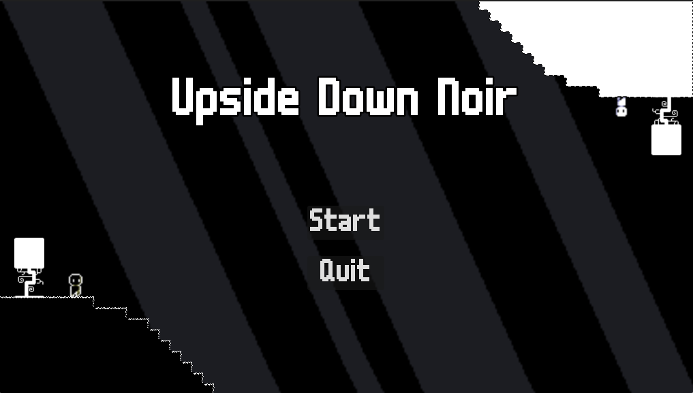
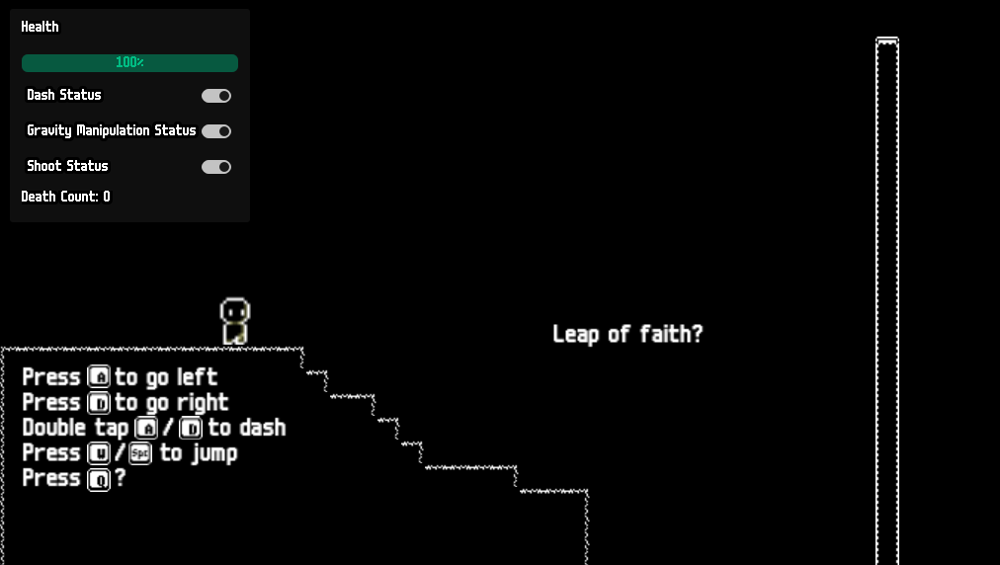
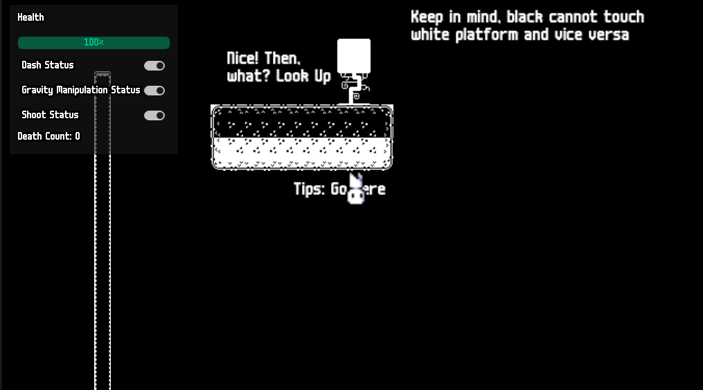
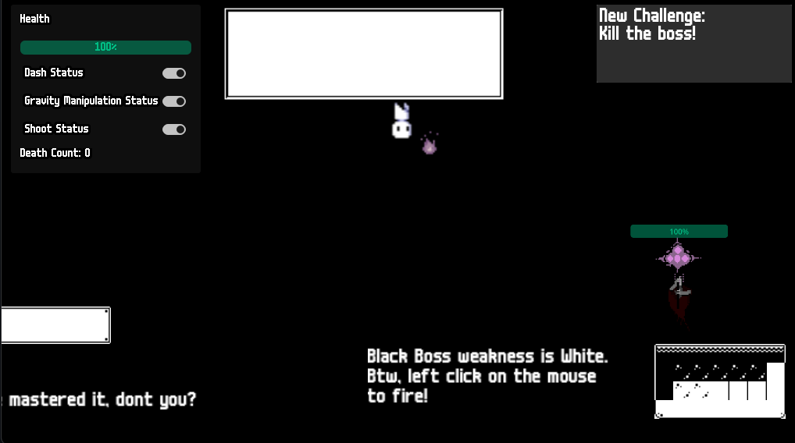
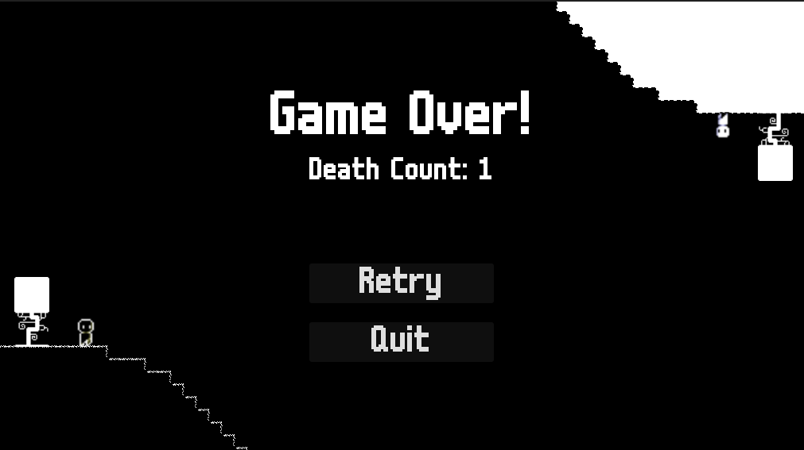
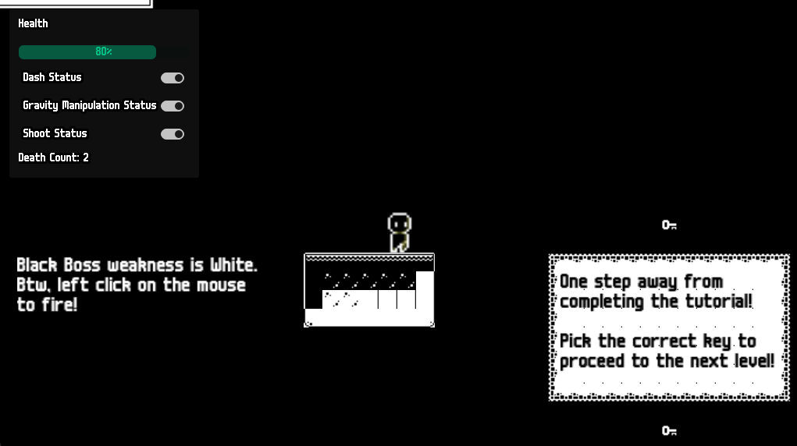
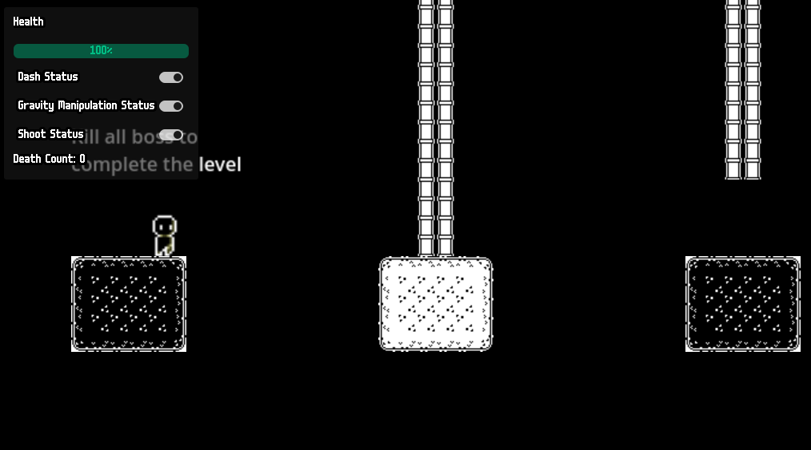
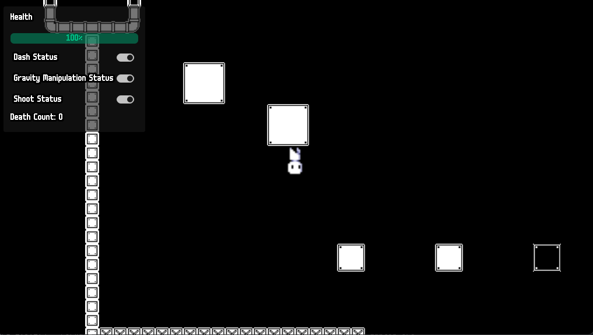
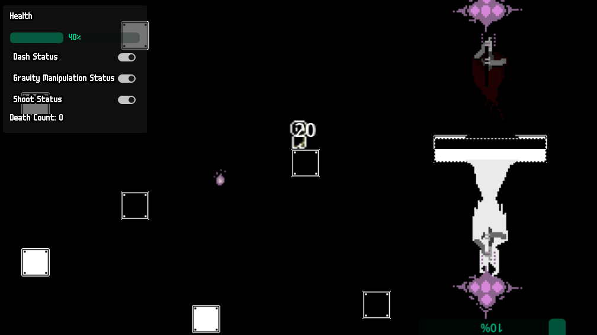

# Individual Game Jam - Game Development 2023/2024

> Godot Version: 4.2.1

## Deskripsi Game

**Upside Down Noir** adalah pengalaman bermain game yang imersif dan unik di mana pemain berperan sebagai Noir, karakter serbaguna yang mampu melawan gravitasi dan memanfaatkan kekuatan api. Dalam game ini, Noir memiliki kemampuan untuk mengubah gravitasi sesuka hati, bertransisi antara bentuk hitam dengan gravitasi normal dan bentuk putih dengan gravitasi terbalik. Transformasi warna ini tidak hanya memengaruhi gravitasi tetapi juga memengaruhi interaksi Noir dengan lingkungan.

Tujuan dari **Upside Down Noir** adalah untuk menavigasi melalui level-level menantang yang dipenuhi dengan platform hitam dan putih. Saat Noir dalam bentuk hitam, ia tidak dapat menyentuh platform putih, dan saat dalam bentuk putih, ia harus menghindari platform hitam. Mekanik ini menambahkan lapisan strategi dan pemecahan teka-teki yang menarik karena pemain harus mengatur waktu dengan cermat perubahan gravitasi untuk maju melalui level.

Tantangan utama menanti di akhir setiap level, di mana Noir berhadapan dengan bos penyihir yang kuat. Warna penyihir, baik hitam atau putih, menentukan bentuk Noir mana yang dapat menimbulkan kerusakan. Penyihir putih hanya bisa dikalahkan oleh Noir hitam, sedangkan penyihir hitam hanya bisa dikalahkan oleh Noir putih. Pemain harus menguasai seni manipulasi gravitasi dan memanfaatkan kemampuan menembakkan api dari Noir untuk mengatasi musuh-musuh yang tangguh ini dan muncul sebagai pemenang.

**Upside Down Noir** menawarkan perpaduan yang menawan antara platforming, pemecahan teka-teki, dan pertarungan melawan bos, menjadikannya petualangan yang menggembirakan bagi para gamer yang mencari pengalaman baru dan inovatif.

### Konsep Game

Konsep game **Upside Down Noir** memadukan tiga *diversifier* unik, sebagai berikut.

1. Yeet: Noir dapat memanfaatkan kekuatan api untuk menembak bos penyihir yang menghalangi Noir dalam perjalanannya menyelesaikan berbagai level.
2. Orange is the New Black: Noir dapat bertransformasi ke dalam bentuk hitam dan putih dengan masing-masing bentuk memiliki kemampuan yang berbeda.
   - Noir hitam bergerak dalam gravitasi normal (arah gaya gravitasi ke bawah), dapat menyetuh platform hitam saja, dan dapat menyerang penyihir putih.
   - Di sisi lain, Noir putih bergerak dalam gravitasi terbalik (arah gaya gravitasi ke atas), dapat menyetuh platform putih saja, dan dapat menyerang penyihir hitam.
3. Tsunomaki Janken: Noir hitam hanya dapat menyetuh platform hitam dan mengalahkan penyihir putih. Noir Putih hanya dapat menyetuh platform putih dan mengalahkan penyihir hitam. Dengan demikian, Noir harus memanfaatkan kedua bentuk tersebut untuk mengatasi kelemahan masing-masing bentuk dan memanfaatkan kelebihan masing-masing bentuk. Kelemahan dan kelebihan dari masing-masing bentuk Noir berbanding terbalik.

### Panduan Cara Bermain

Cara bermain game ini sangat mudah. Yuk, kita simak!

1. Ketika pemain memulai permainan, pemain akan berada dalam halaman menu.
2. Pemain harus menekan tombol `Start` untuk memulai permainan.

    

3. Jika pemain baru pertama kali bermain, pemain akan masuk ke level tutorial yang menjelaskan mekanisme permainan.

    

    - Tekan tombol `A` untuk begerak ke kiri
    - Tekan tombol `D` untuk begerak ke kanan
    - Tekan tombol `A` atau `D` dua kali untuk *dash*
    - Tekan tombol `W` atau `Space` untuk melompat
    - Tekan tombol `Q` untuk mengubah bentuk Noir dan memanipulasi gravitasi.
    - Tekan `Right Click` pada mouse untuk menembak.

4. Pemain akan bergerak ke kanan peta untuk menyelesaikan level dengan menghadapai berbagai tantangan.

    

5. Pemain akan bertemu bos di akhir level dan bertarung sekuat tenaga untuk mengalahkan bos tersebut.

    

    Jika pemain dikalahkan bos penyihir, pemain dapat mengulang level tersebut.

    

6. Setelah Pemain mengalahkan Boss, pemain harus mengambil *key* yang berada di ujung peta untuk lanjut ke level berikutnya.

    

7. Selamat Anda berhasil menyelesaikan tutorial (atau mengulang level kembali bila salah memilih kunci).

> Tips: Ingat kemampuan dari masing-masing bentuk Noir

### Screenshot Game Level 1

### Tautan Kode Sumber

- [Github](https://github.com/LyzanderAndrylie/gamedev-individual-game-jam)
- [Executeable File](https://github.com/LyzanderAndrylie/gamedev-individual-game-jam/tree/main/builds/)

## Sumber asset

1. [Pixel Protagonist](https://penzilla.itch.io/protagonist-character)
2. [Slime](https://craftpix.net/freebies/free-slime-sprite-sheets-pixel-art/)
3. [Background Cloud](https://craftpix.net/freebies/free-sky-with-clouds-background-pixel-art-set/)
4. [Background Cave](https://pixfinity.itch.io/the-dungeon-pack)
5. [Fire Animation](https://brullov.itch.io/fire-animation)
6. [Font](https://managore.itch.io/m6x11)
7. [VFX Starter Pack](https://sangoro.itch.io/vfx-starter-pack)
8. [Pixel Bullet](https://bdragon1727.itch.io/fire-pixel-bullet-16x16)
9. [Effect and Bullet](https://bdragon1727.itch.io/free-effect-and-bullet-16x16)
10. [1 Bit Pixel Art Forest](https://edermunizz.itch.io/1-bit-pixel-art-forest)
11. [Black and White Tiles](https://that-gray-guy.itch.io/simple-black-and-white-tiles)
12. [1 Bit Platformer Pack](https://kenney-assets.itch.io/1-bit-platformer-pack)
13. [1 Bit Keyboard Icons](https://ansdor.itch.io/button-icons)
14. [Sorcerer Villain](https://lionheart963.itch.io/sorcerer-villain)
15. [Game Audio](https://mixkit.co/free-sound-effects/game/)
